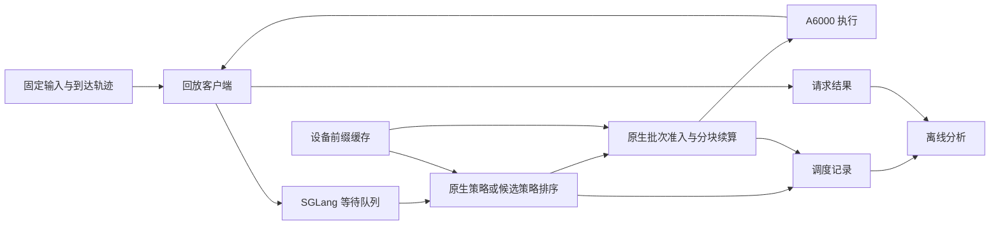

# SGLang 调度实验：项目设计

更新日期：2026-09-10。本文把已认可的策略方向细化为实现与实验设计；所有配置值均未经过远程服务器实测。执行顺序见[实现计划](implementation-plan.md)，术语以[共同语言](../CONTEXT.md)为准，原生行为的依据见[调研文档](scheduling-research.md)。

## 实现落地说明

四种候选已由 `patches/scheduler.patch` 实现，操作入口见 [Linux 手册](operations-linux.md)。实现增加一个无 GPU 依赖的 `scheduler_lab.py` 供排序与记录共用；现有 Req 对象新增本轮序号属性，时间复用 `wait_queue_entry_time`。记录在内存中保留，通过运行结束前查询 `/server_info` 导出。

GPU 标定包住 `ModelRunner.forward`，使用当前 stream 的 CUDA events 并同步结束 event，独占请求且关闭 overlap；正式性能运行保持默认 overlap。这样可以明确请求与分块前向计时的归属，但模型只是独占成本代理，不能代替在线比较。该差异写入成本 JSON 和运行配置。真实 GPU 接入、安装兼容性和成本系数仍待服务器验证。

## 1. 项目目标与交付

在单卡 A6000 上实现四个简单的等待请求排序策略，与 SGLang 原生 `fcfs`、`lpm`、`dfs-weight`、`hrrn` 比较，说明剩余 prefill 工作量、实际等待时间和调度 CPU 开销如何影响服务性能。

主要实现对象为 `short-input`、`short-remaining`、`aged-remaining`、`aged-cost`。`aged-lpm`、`hrrn-time` 保留为解释具体实验现象的补充。四个主要策略都进入实现计划；成本模型即使没有获益，也保留实现和实验结论。

项目完成时应有：可读的上游修改、能够在离线服务器运行的实验文件、请求级原始记录、可追溯到运行条件的结果表和图，以及可以在面试中讲清楚的适用范围。完成不以预设加速百分比为条件。

第一版仅覆盖单模型、普通自回归文本生成、单卡 `TP=1`、设备侧前缀缓存。排序之后继续使用原生批次准入、分块续算、KV 分配和引用管理。PD 分离、多卡排序同步、多层缓存、投机解码和业务优先级不进入本轮实现。

## 2. A6000 环境与初始配置

### 已知事实与设计假设

| 项目 | 内容 | 状态 |
| --- | --- | --- |
| 服务器 GPU | 单卡 A6000 | 用户已提供 |
| 驱动 | `580.173.02` | 用户已提供 |
| CUDA | `12.9` | 用户已提供；准备阶段分别记录 Toolkit 与 PyTorch 构建版本 |
| GPU 规格 | 按 NVIDIA RTX A6000 的 Ampere、48 GB 规格设计 | 官方产品规格；不是可用显存实测值 |
| 并行方式 | `TP=1`，单服务实例 | 本项目确定的范围 |
| 主模型 | `Qwen/Qwen2.5-7B-Instruct` | 设计默认值，尚未下载或运行 |
| Python | 优先复用兼容的现有环境；新环境优先 Python 3.11 | 待服务器记录 |
| CPU、内存、Linux 发行版、磁盘、已有模型 | 未提供 | 准备阶段记录 |

RTX A6000 的产品规格支持上述显存与架构假设。[NVIDIA 产品页][ref-gpu] 驱动 `580.173.02` 高于 CUDA 12.9 Update 1 所列的 Linux 驱动版本 `575.57.08`，本项目不以升级驱动为前提；具体 Python 包与内核组合仍需在实际环境运行。[CUDA 12.9 发行说明][ref-cuda]

保留上次调研提交 `0027af2eace5ccc2116c8c993ce71aebf1535264` 作为初始源码基线。该版本的默认依赖已经包含 CUDA 13 组件，离线准备应采用其文档提供的 CUDA 12／`cu129` 路径，不能在服务器上直接照搬默认联网安装命令。[固定版本安装说明][ref-install] [固定版本依赖声明][ref-deps]

准备阶段选定可安装的包组合后，记录具体版本和实际源码提交。若确有兼容性问题需要换 SGLang 版本，则四个原生基线与所有候选一起切换并更新文档；如果把 HRRN 移植到旧版，应明确标为上游实现的移植，不能称为该旧版原生自带。

### 为什么选择这个模型

Qwen2.5-7B-Instruct 使用常规因果注意力，官方配置为 28 层、4 个 KV head、每 head 128 维，默认 `bfloat16`，且未开启滑动窗口。这使输入长度和缓存前缀对成本的影响较容易解释。[模型说明][ref-model] [模型配置][ref-model-config]

按 BF16 计算，KV 理论存储量约为：`2 × 28 × 4 × 128 × 2 = 57,344 bytes/token`。131,072 个 token 的 KV 约为 7 GiB；这是由模型配置推算的量，不含权重、激活、CUDA Graph 和其他运行开销。最终容量采用服务启动日志中的实际值。

### 启动参数起点

以下是配置文件将保存的初始值；首轮容量观察后，只调整有实际原因的项，再用于全部策略。

| 参数字段 | 初始值 | 用途 |
| --- | --- | --- |
| `model_path` | 模型在服务器上的本地路径 | 离线读取模型和 tokenizer |
| `tp_size` | `1` | 单卡执行 |
| `dtype` | `bfloat16` | 固定模型精度 |
| `kv_cache_dtype` | `auto`，记录实际解析值 | 随模型精度，主实验不使用 KV 量化 |
| `context_length` | `20480` | 容纳最长 16K 输入与本轮输出 |
| `mem_fraction_static` | `0.80` | 静态显存配置起点，不代表 KV 单独占 80% |
| `max_total_tokens` | `131072` | KV token 容量上限，区别于一次批次预算 |
| `chunked_prefill_size` | `2048` | 固定分块设置 |
| `max_prefill_tokens` | `8192` | 固定该配置值；实际批量还受引擎解析、上下文和分块约束，不把它当作所有路径的硬上界 |
| `max_running_requests` | `64` | 固定运行请求上限，不等于客户端并发上限 |
| `attention_backend` | 优先 `flashinfer` | 若实际包组合不适配，可统一采用 `triton` 并重测基线 |
| radix cache | 开启 | 获得真实前缀复用 |
| overlap、CUDA Graph | 保持该版本正常启用设置并记录解析值 | 保留常规服务执行方式 |
| mixed chunk、HiCache、业务优先级 | 不启用 | 收敛实验变量 |

官方后端说明将 FlashInfer 列为 Ampere 常规注意力的默认选择之一，Triton 可作替代。[注意力后端说明][ref-attention] 是否有对应离线 wheel 或 JIT 编译依赖，属于安装准备内容，不在本文假定已经具备。

主性能负载使用流式输出、`temperature=0`、`max_new_tokens=128`、`ignore_eos=true`，形成固定生成长度的合成实验；同时记录实际输出量。少量真实文本正确性观察使用正常 EOS 行为，二者分开报告。

## 3. 接入方式与代码归属



支持性仓库存放文档、实验脚本、配置、分析结果和一个相对固定上游基线的补丁。完整 SGLang 工作副本位于被忽略的 `upstream/`，直接在那里编辑真实源码，然后导出补丁；不再维护一套同内容的源码副本或运行时 monkey patch。

| 位置 | 修改内容 |
| --- | --- |
| `schedule_policy.py` | 新策略标识、独立分发、候选选择、匹配与排序；原生分支保留原有行为 |
| `arg_groups/fields/schedule.py` | 新策略选项、三个策略配置项和一个测量输出开关 |
| `scheduler.py` | 入队序号、首次入队与准入事件、批次构建计时 |
| `schedule_batch.py` | 一个本轮入队序号字段；必要的请求输入语义接入 |
| 同一 managers 目录中的小型辅助模块 | 如有需要，容纳纯排序函数、成本模型读取或测量收集；按内容创建 |
| 项目 `experiments/` | 负载生成、单次运行、回放、GPU 标定与分析 |

新增逻辑采用直接分支和少量函数，不建设策略插件框架。只有代码真正分离后更易阅读或测试时才拆模块。

## 4. 策略的确定规则

### 输入与时间语义

| 符号 | 定义 |
| --- | --- |
| `L_input` | 原始输入 token 数，用于 `short-input` 及长短请求分组 |
| `L_work` | 本轮待处理的完整已知序列长度；普通新请求等于 `L_input`，请求回退时包含已有输出 |
| `H` | 本次排序评估的有效设备前缀命中，应用引擎的匹配上限 |
| `R` | `max(0, L_work - H)`，待完成的 prefill token 数 |
| `w_ms` | 当前单调时钟减本轮入队时刻，换算为毫秒 |
| `a` | 本轮入队序号，单调增加，用于稳定排序 |
| `τ_ms` | 等待提升阈值 |
| `T_hat_ms` | 成本模型给出的 prefill 耗时估计 |

每次 `calc_priority()` 只读取一次当前时间，供该轮所有请求使用。复用现有本轮 `wait_queue_entry_time`；新增序号在首次入队与请求回退重新入队时赋值，分块续算不重新入队。首次排队等待由测量收集器在事件发生时单独保留。

缓存匹配使用现有 `match_prefix_for_req()` 和请求的前缀限制语义。普通输入常见的“至少还需处理末 token”限制不能被纯长度减法绕开；不因文本完全相同就自行令 `R=0`。排序时命中只用于评分，真正进入批次仍调用原生输入准备流程。

### 四个主要策略

| 标识 | 完整排序规则 | 需要的新增信息 |
| --- | --- | --- |
| `short-input` | `(L_input, a)` 升序 | 入队序号 |
| `short-remaining` | `(R, a)` 升序 | 真实设备前缀匹配 |
| `aged-remaining` | 先取 `w_ms >= τ_ms` 的请求按 `a` 排列；其余按 `(R, a)` | 本轮实际等待时间 |
| `aged-cost` | 同样先提升超阈值请求；其余按 `(T_hat_ms, a)` | 标定后的成本模型 |

超阈值请求的排序优先于成本或命中收益。请求仍可能因准入预算不足而无法执行，因此 `τ_ms` 不构成等待上界。`τ_ms=0` 时，两个 aging 策略退化为按本轮入队序号考察；禁用 aging 的消融直接使用对应未老化策略。

### 与原生行为的关系

四个原生策略使用原始排序键、队内共享降级和策略回退条件。新策略放在通用全队列匹配之前的独立分支中，不继承 LPM／HRRN 的 128 阈值回退；长队列开销由后面的有界变体衡量。

四个主要候选只利用已经存在的缓存命中，不对“队内其他请求未来会产生的缓存”增加临时降级。这样候选之间的输入长度、剩余量、aging、成本模型消融共享同一套规则。与原生 LPM／HRRN 比较时，要把其队内共享逻辑也视作基线的一部分，不能把所有差异都归因于一个排序键。

若显式关闭 radix cache，新策略令 `H=0`，继续按各自规则排序；原生策略保留自身调整逻辑。该配置只做机制说明，不放入主缓存实验。

### 配置项

以下参数已由本项目补丁加入，应用补丁后的源码支持它们，未修改的上游不支持：

| 参数 | 定义 | 起点 |
| --- | --- | --- |
| `--schedule-aging-threshold-ms` | aging 策略的实际等待阈值 | `500`，仅用于初始探索；正式参数依据 FCFS 分布选定 |
| `--schedule-candidate-limit` | 普通候选数量；`0` 表示全队列 | `0`，先比较完整排序，再测 32／64／128 |
| `--schedule-cost-model` | 本地 JSON 标定结果路径 | 仅 `aged-cost` 使用，启动时读取一次 |
| `--schedule-trace-dir` | 本轮服务端测量产物目录 | 默认不记录；正式比较的所有策略均指定 |

配置无有效成本模型时，`aged-cost` 应直接说明缺少模型，不能静默变成 `aged-remaining`。只保留这类影响实际算法含义的基本输入错误提示。

## 5. 有界候选与缓存状态

对 aging 策略，每轮先从整个等待队列找出全部超阈值请求，按本轮入队序号组成 `U`。从其余请求中取最早到达的 `K` 个组成普通候选 `C`；未入选部分为 `T`。输出顺序是：`U + 按成本排序的 C + 保持本轮扫描顺序的 T`。

`K=0` 时 `C` 覆盖所有普通请求。非 aging 策略的 `U` 为空，也可使用同样的候选限制。`short-input` 不需要新增前缀查询；其余三个主要候选只对 `C` 做评分匹配。`U` 为排序不必计算成本，但进入批次时仍正常匹配。

选择 `C` 使用入队序号和 `heapq.nsmallest`，不假定上一轮改排后的队列仍按到达排序。老化扫描覆盖 `T`，因此已经久等的队尾请求不会因为候选窗口而漏掉。

新增评分匹配次数上限是 `|C|`，不是整轮调度全部匹配次数的上限。全队列扫描、选择、超阈值排序和队列重建仍有随队列增长的 CPU 成本；最终准入也可能匹配 `U`、`T` 中的请求。

新策略的 `waiting_queue_prefix_matched()` 统一返回 `False`，使现有负载查询采用缓存未命中比例估计，而不读取整队列中可能陈旧的命中值。当前消费者已经提供这个估计分支，不需要建立额外的匹配版本号或全队列重匹配机制。[负载查询实现][ref-load]

这是有意选择的统计口径：新策略的等待 token 负载查询是估计量。本项目的实际命中率来自执行结果，调度 CPU 成本来自直接计时；二者都不依赖该负载估计。原生策略的匹配与负载统计行为保留原样。

## 6. `aged-cost` 的标定与使用

使用以下小型非负成本模型，输出单位统一为毫秒：

```text
T_hat_ms = β0 + β1 × R + β2 × [H × R + R × (R + 1) / 2]
β0, β1, β2 >= 0
```

线性项近似新 token 的计算量，方括号近似因果注意力中新增 query 对已有前缀和新 token 的访问量。它是本项目的排序代理，不能当作连续批处理下每个请求的精确完成时间。

标定按以下方式进行：

1. 使用同一模型、BF16、注意力后端和分块设置，服务端一次仅运行一个被测请求；缓存预热和请求等待不计入标签。
2. 初始目标网格为 `H ∈ {0, 1024, 8192, 12288}`、`R ∈ {128, 512, 1024, 4096}`，共 16 组。每次样本使用新的后缀，或在计时之外清理并重建目标前缀，避免前一轮把整个输入缓存下来。记录实际匹配到的 `H`、实际 `R`，不把目标命中当作事实。
3. 每组先做少量预热，再采集例如 20 次设备测量，取中位数。通过模型 worker 上的 CUDA events 或已有 profiler 测量 prefill 前向；若有多块，累计对应各块设备执行时间，排除 decode 与预热。
4. 以目标组合为单位划分拟合组和保留组，例如 12 组拟合、4 组验证。同一组合的重复样本不拆到两边。
5. 将成本模型与纯 `R` 的排序在保留组上比较，报告成对顺序判断和相关性；只作为理解估计器的证据，再用在线 TTFT、等待和吞吐判断实际价值。

CUDA events 需要在实际模型执行的进程和流上使用，并在读取结果前等测量完成。这种同步仅用于独立标定运行，不加入正式调度热路径。正式服务只进行少量标量运算。

JSON 产物保存系数、毫秒单位、模型名称、实际运行配置和标定样本位置；这些是解释模型适用范围的记录。模型在启动时读取，运行中不在线训练、不周期性重拟合。

先比较使用相同 `τ_ms`、相同候选范围的 `aged-cost` 与 `aged-remaining`。如果最终性能没有超过剩余 token 版本，继续交付标定和对照结果，最终推荐可以仍是 `aged-remaining`。

## 7. 负载与比较方式

### 负载固定为请求轨迹

一条轨迹记录一个请求的 `rid`、计划到达偏移、输入 token IDs、原始输入长度、共享前缀组、生成参数。输入长度包含真正提交给模型的完整输入；使用 `/generate` 的 `input_ids` 接口避免聊天模板使各轮长度变化。

官方请求结构支持显式 `rid` 和 `input_ids`。[请求接口源码][ref-io] `rid` 在同一条轨迹内唯一、跨策略保持一致，客户端和服务端按 `run_id + rid` 关联。编号与长短类别不绑定，避免 HRRN 的平局次序偶然偏向某类请求。

第一阶段按合成 token 轨迹研究机制，同时保存少量可读文本样例。随机 token 的性能结论不被描述为真实业务质量结论。

| 负载标识 | 设计起点 | 核心问题 |
| --- | --- | --- |
| `mixed-low-reuse` | 约 80% 短输入，长度 512／1024／2048；20% 长输入，8192／16384；前缀尽量独立 | 短输入优先与剩余量优先是否接近 |
| `prefix-conflict` | 混合 A：16K 输入、目标 12K 前缀，与 B：2K 输入、目标 1K 前缀；再加入同为 16K、不同命中量的请求 | 命中总量、原始长度、剩余量是否给出不同顺序 |
| `hot-prefix` | 少数热门前缀组和独立组混合；相同组的后缀不同 | 缓存聚集的收益与被打散的代价 |
| `long-wait` | 固定长请求群体穿插在持续短请求流中 | 超阈值提升能改善多少长请求等待 |
| `burst-decode` | 突发到达，并把部分输出延长到 512／1024 token | 队列超过 128、原生策略回退及较多 decode 下的老化差异 |

`prefix-conflict` 不能只有 A/B 两类，否则 `short-input` 与 `short-remaining` 可能始终给出相同次序，无法检验缓存信息的独立价值。输入组别在运行前固定：短请求 `L_input <= 2048`，长请求 `L_input >= 8192`，中间组单独呈现。

### 到达率与缓存状态

回放客户端优先运行在远程服务器，通过回环地址调用服务；Linux 登录设备只负责 `ssh` 与文件流转。这样减少 SSH 网络条件对 TTFT 的影响。仍记录客户端 CPU 占用和实际发送延迟，判断回放程序是否跟上轨迹。

每种负载先用 FCFS 做少量递增请求率的容量探索，确定低负载率与排队明显但能完成有限请求集的较高率。所有策略使用这两个相同数值；突发到达作为另外的诊断负载，不替代持续到达实验。

轨迹记录计划到达时间，客户端同时保存实际发送时间。调度公平性由服务端本轮入队时间驱动。客户端不靠等待前一个请求完成再发送下一个来控制请求率；如需并发上限，所有策略保持一致，并显示客户端积压情况。

每轮使用新服务进程或明确重置到相同初始缓存状态。引擎预热、冷缓存清理、热缓存前缀预热按固定顺序执行；预热请求全部完成后才开始测量。正式运行的缓存演化由策略产生，不在请求之间强制复原。

### 主比较与消融

机制筛选先比较四个原生策略和前三个候选，在 `prefix-conflict` 与 `long-wait` 上各做一次探索，约 14 次运行。成本模型完成后增加与 `aged-remaining` 的成对实验。

正式主比较使用四个原生策略加一个最终候选，在两个事先选定的代表负载、两个固定请求率和三个独立轨迹种子上运行，约 60 次。最终候选与参数在主比较前确定；所有被实现的候选都在消融表或探索记录中呈现。

有界候选使用同一策略的全队列版本与 `K=32／64／128` 对照。`τ_ms` 依据独立探索阶段 FCFS 的等待分布选三档；一次只改变一个因素。另在一个代表负载比较分块大小 2048 与 4096，改变分块时一起重跑相关基线。

核心结果应包含至少一个队列大部分时间不超过 128 的场景，以比较原生排序机制；另外报告跨过 128 的压力场景。策略回退比例按调度调用次数给出，不能只看配置名称。

## 8. 测量与结果口径

### 客户端记录

客户端保存计划发送、实际发送、首个生成事件与完成时刻、实际输入输出长度、实际缓存复用量、完成状态和错误。以官方 native benchmark 对首个生成事件的口径为参照，不能把 HTTP 响应建立或纯元数据包当作首 token。

固定流式发送设置；若一个返回事件包含多个 token，则 ITL 标为事件间隔，不能把事件间隔直接当作逐 token 时间。主指标为短请求 P95/P99 TTFT，另报告整体 TTFT、TPOT／ITL 与输出长度。

### 服务端记录

| 记录 | 必要内容 | 作用 |
| --- | --- | --- |
| 请求事件 | `rid`、首次入队、首次准入、本轮入队序号、请求回退次数 | 计算首次排队等待，避免重新入队覆盖统计 |
| 调度调用 | 配置策略、实际策略、队列长度、超阈值数、候选数 | 解释策略回退与候选覆盖范围 |
| 调度计时 | 候选选择、评分匹配、成本计算、排序、整个 `calc_priority` 的经过时间 | 分解排序策略代价 |
| 批次构建计时 | `_get_new_batch_prefill_raw` 的经过时间、准入阶段匹配时间与次数 | 防止只把工作从评分阶段移到准入阶段 |
| 截止状态 | 未准入与未完成请求、已经等待的时间 | 给出未完成请求的等待下界 |

采集在单次运行期间保存到内存，结束后批量导出；不在每个 token 或每次比较中同步写文件。每个有限实验结束后通过服务退出路径写出完整记录；失败时仍保留已有客户端结果和服务日志，明确服务端记录是否完整。

实现使用 `perf_counter()` 和 `thread_time()`，相减后转换为毫秒。原生与候选策略使用同样的记录方式，测量开关关闭时不收集明细。在代表性 FCFS 运行中对比有无记录的开销，若它已经影响结论，则减少记录粒度后重测。准入计时包住 `init_next_round_input`，包含缓存匹配和输入准备；总调度、排序、匹配属于嵌套计时，不能相加。

整体调度时间与分项存在包含关系，不能相加后称为总时间。原生队内临时树匹配属于匹配成本，DFS 树遍历属于排序成本；准入阶段匹配另列。每项给调用次数、每调用分布与每完成请求摊销。

### 汇总计算

| 指标 | 计算方式 |
| --- | --- |
| `ttft_ms` | 客户端首个生成事件减实际发送时间 |
| `client_lag_ms` | 实际发送时间减计划发送时间 |
| `first_queue_wait_ms` | 服务端首次准入减首次入队 |
| `long_max_wait_ms` | 长请求中已准入请求的首次排队等待最大值；旁列未准入数量和最大等待下界 |
| `cache_hit_rate` | 成功请求集合的实际复用 token 总数／同集合输入 token 总数 |
| 请求吞吐、输出吞吐 | 完成请求数或实际输出 token 数／注明口径的总时长 |
| `policy_fallback_calls` | 配置策略与实际分支不一致的调用次数 |
| `request_retractions` | 请求重新入队的回退次数，不与上一项合并 |

TTFT 在客户端内部、首次等待在 scheduler 内部计算，通过请求 ID 合并结果。本项目客户端固定在同一台 Linux 服务器运行，分析用同机 `perf_counter()` 单调时钟截取测量窗口并计算未准入请求等待下界；不支持把另一台设备的单调时钟直接混入这些计算。流式 TTFT 包含传输和服务端各阶段，不能从中直接分离 GPU prefill 耗时。

停止注入后默认等有限请求集完成再汇总，并同时保存注入结束和排空结束时间。若人工中止运行，则如实列出成功、失败、取消和未完成数量及等待下界。成功子集的分位数仍可展示，但不能据此宣称所有长请求等待得到了控制。

每轮分别计算分位数，再展示三轮值或范围；不把三个 P99 简单平均后当成所有样本的 P99。总表保留每轮的组内样本数、请求率、实际容量和回退信息。

## 9. 文件与离线流转

以下目录是后续实现时按需创建的目标结构，目前只有文档已经存在：

```text
sglang-scheduler-lab/
  CONTEXT.md
  README.md
  docs/
    scheduling-research.md
    project-design.md
    implementation-plan.md
  patches/
    upstream-base.txt
    scheduler.patch
  configs/
    a6000.json
  experiments/
    generate_workload.py
    run_case.py
    replay.py
    calibrate.py
    analyze.py
  runs/<run_id>/
    run.json
    input.jsonl
    client.jsonl
    server-requests.jsonl
    scheduling.csv
    server.log
    summary.json
  results/
    calibration/
    comparison.csv
    figures/
    interview-notes.md
  upstream/                 # 完整 SGLang 工作副本，不提交
```

`run.json` 记录本次配置、源码提交、模型、实际环境、策略、参数、随机种子、观测起止与完成状态。`input.jsonl` 是该轮实际使用的轨迹副本；热缓存负载另带对应预热输入副本。请求记录与 CSV 仅采用易读字段，不引入独立 schema 验证框架。

`run_case.py` 负责单个案例：使用本地模型启动本轮服务、建立规定缓存状态、回放有限轨迹、收集结果并正常结束自己启动的服务。第一版不建设任务队列、失败自动重试平台或批量调参系统；多个案例可由明确的命令列表顺序运行。

Linux 登录设备下载源码、模型、tokenizer 和匹配服务器的 Python／CUDA 依赖，连同项目文件传入服务器。在服务器使用本地 Git 记录上游修改，运行产物传回 Linux 登录设备，再提供 Windows 分析副本。GitHub 由操作者在网页端手动上传提交，发布不影响实验启动。

如果登录设备的 Python ABI 或平台与服务器不同，下载与打包应以服务器为目标；JIT 所需工具或预编译缓存也一并准备。具体安装文件清单在环境准备阶段形成，当前不创建无法运行的占位安装脚本。

## 10. 实现验证与完成标准

验证只围绕会影响实验正确性的行为：

- 排序不丢失或重复请求；相同评分按本轮入队顺序稳定排列。
- 队尾超阈值请求能进入提升集合；候选数量限制不会隐含改变阈值语义。
- 匹配采用实际 token 与引擎上限；完整前缀命中、候选未准入后再次评估、请求回退等情况下不沿用错误长度。
- 首次排队等待不因请求回退或分块续算被覆盖；策略回退和请求回退分别记录。
- 同输入、同生成配置的真实 GPU 运行能完成请求并保留正确关联的输出。输出有差异时检查数值、批次和采样因素，不把逐字节一致性设为性能实验门禁。
- 小型人工可核对记录能正确得到分位数、吞吐、命中率与未完成请求的统计。

文档、简单配置和只是复述实现的改动不单独编写测试。局部 Python 检查用于验证排序与统计语义，真实缓存复用、服务完成情况和性能结论以 A6000 运行结果为准。

最终交付包含四个主要策略的实现、四个原生基线的主比较、成本与候选范围的消融、三类核心图和面试讲解稿。实验若显示新策略不占优，完成标准仍是能够用数据解释原因和适用边界。源码提交和运行配置用于解释结果，不增加哈希、冒烟、契约或审批门禁。

## 11. 本次设计新增的资料依据

- [NVIDIA RTX A6000 产品规格][ref-gpu]；[CUDA 12.9 Update 1 发行说明][ref-cuda]
- [Qwen2.5-7B-Instruct 模型说明][ref-model]；[模型配置][ref-model-config]
- [固定 SGLang 版本的安装说明][ref-install]；[依赖声明][ref-deps]
- [SGLang 注意力后端说明][ref-attention]
- [等待 token 负载查询源码][ref-load]；[原生生成请求接口][ref-io]

[ref-gpu]: https://www.nvidia.com/en-us/products/workstations/rtx-a6000/
[ref-cuda]: https://docs.nvidia.com/cuda/archive/12.9.1/cuda-toolkit-release-notes/index.html#cuda-driver
[ref-model]: https://huggingface.co/Qwen/Qwen2.5-7B-Instruct
[ref-model-config]: https://huggingface.co/Qwen/Qwen2.5-7B-Instruct/blob/main/config.json
[ref-install]: https://github.com/sgl-project/sglang/blob/0027af2eace5ccc2116c8c993ce71aebf1535264/docs/docs/get-started/install.mdx
[ref-deps]: https://github.com/sgl-project/sglang/blob/0027af2eace5ccc2116c8c993ce71aebf1535264/python/pyproject.toml
[ref-attention]: https://docs.sglang.io/docs/advanced_features/attention_backend
[ref-load]: https://github.com/sgl-project/sglang/blob/0027af2eace5ccc2116c8c993ce71aebf1535264/python/sglang/srt/managers/scheduler_components/load_inquirer.py#L80-L95
[ref-io]: https://github.com/sgl-project/sglang/blob/0027af2eace5ccc2116c8c993ce71aebf1535264/python/sglang/srt/managers/io_struct.py#L173-L188
